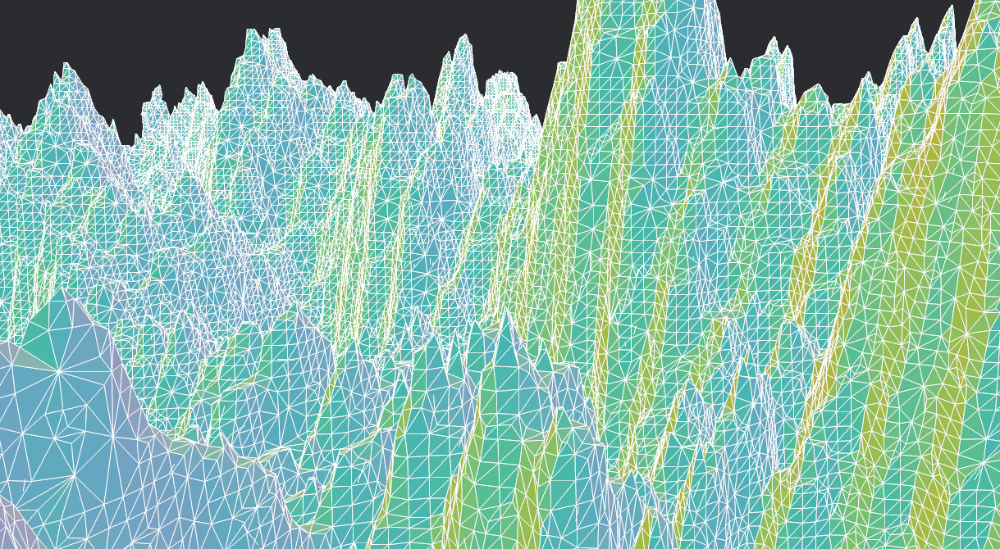
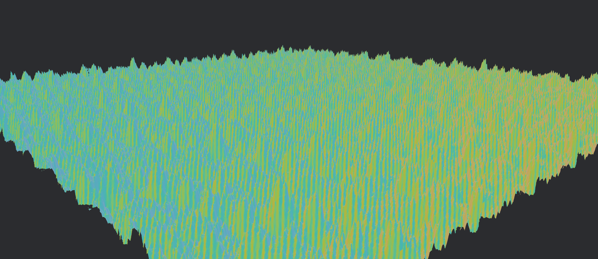
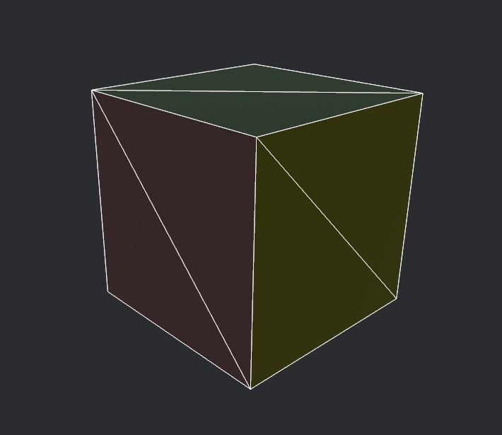
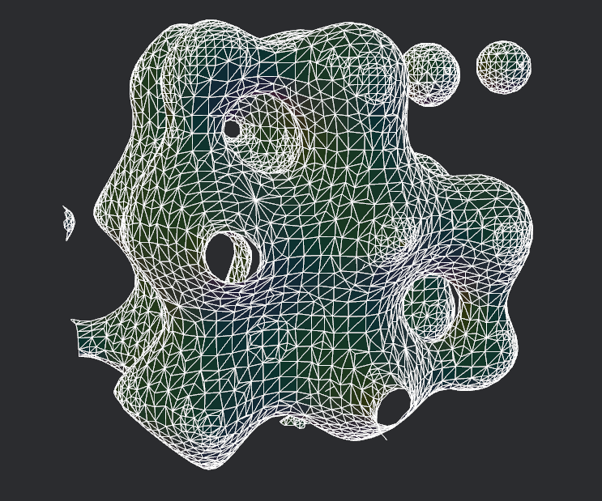
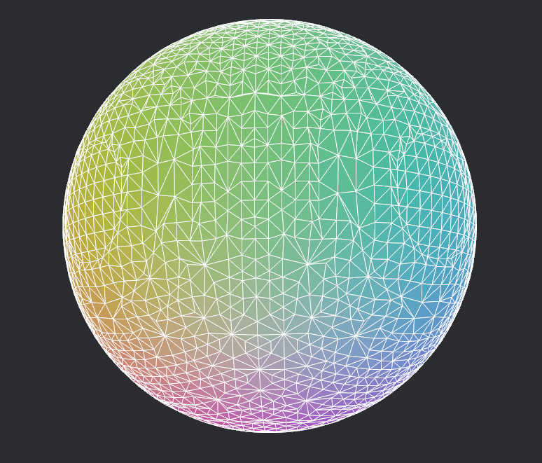

# isomesh

A tool for generating procedural isosurface meshes from SDFs or volumetric data.

Built and tested for Bevy integration, but can be used independently.

Some algorithms from https://github.com/Lin20/isosurface

Fully multithreaded - this will blast your CPU on a large workload.

Large scale mesh >10 million triangles

A low poly cube with sharp corners, which is impossible to reproduce on most meshing algorithms. 

A manifold mesh, utilizing the manifold dual contouring features.

Every meshing algorithm can do this

